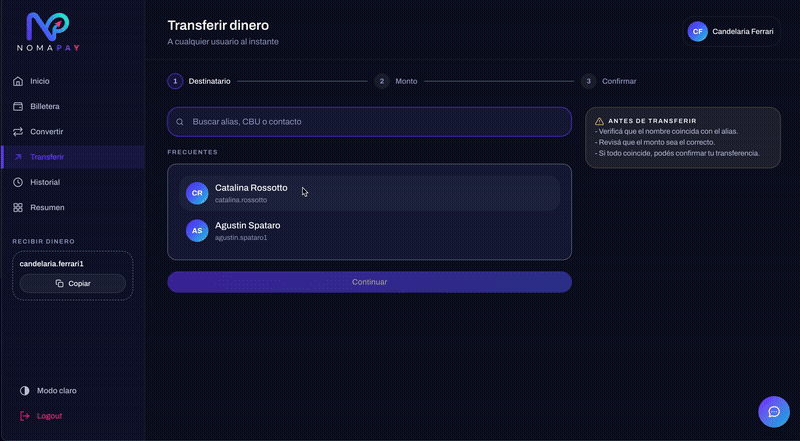

# NomaPay — Frontend

Frontend de **NomaPay**, una billetera digital pensada para viajeros y nómades digitales: manejar varias monedas, transferir dinero, convertir entre monedas propias y llevar un seguimiento claro de los movimientos, todo desde una sola app.

Proyecto Final de la carrera Full Stack de Henry, desarrollado en equipo (frontend + backend) siguiendo una metodología ágil por sprints.

Este repositorio contiene **exclusivamente** la aplicación **Frontend**, construida con **React, TypeScript y Vite**, e integrada contra la API REST de NomaPay ([`NomaPay_backend`](https://github.com/nomapayapp-collab/NomaPay_backend)).

## Índice

- [Capturas](#capturas)
- [Funcionalidades](#funcionalidades)
- [Tecnologías utilizadas](#tecnologías-utilizadas)
- [Arquitectura del proyecto](#arquitectura-del-proyecto)
- [Autenticación y sesión](#autenticación-y-sesión)
- [Rutas principales](#rutas-principales)
- [Instalación](#instalación)
- [Variables de entorno](#variables-de-entorno)
- [Scripts disponibles](#scripts-disponibles)
- [Testing](#testing)
- [Diseño y sistema visual](#diseño-y-sistema-visual)
- [Deploy](#deploy)
- [Estado del proyecto](#estado-del-proyecto)
- [Equipo](#equipo)

## Capturas

<!--
  TODO: reemplazar estos placeholders por capturas/gifs reales de la app.
  Sugerencia de contenido (un archivo por punto, mismo nombre que la ruta):

    docs/screenshots/dashboard.png     -> Dashboard con saldo y accesos rápidos
    docs/screenshots/wallet.png        -> Billetera con saldos multi-moneda
    docs/screenshots/exchange.png      -> Convertir monedas (con comisión visible)
    docs/screenshots/transfer.gif      -> Flujo completo de Transferir (buscar alias -> confirmar)
    docs/screenshots/summary.png       -> Resumen semanal con gráfico
    docs/screenshots/chat-assistant.gif -> Asistente conversacional respondiendo una consulta
    docs/screenshots/dark-light.gif    -> Toggle de tema claro/oscuro

  Una vez que estén los archivos en docs/screenshots/, descomentar las líneas
  de abajo (o reemplazar esta sección entera).

  
  
-->

*(Próximamente: capturas y GIFs de las pantallas principales.)*

## Funcionalidades

### Autenticación

- Registro e inicio de sesión con email y contraseña.
- Inicio de sesión con Google (`@react-oauth/google`).
- Recuperar y restablecer contraseña por email.
- Sesión basada en cookies `httpOnly` (no en `localStorage`/tokens expuestos al JS) con renovación automática del access token vencido — ver [Autenticación y sesión](#autenticación-y-sesión).
- Cierre de sesión y protección de rutas privadas (`ProtectedRoute`).

### Dashboard

- Saludo personalizado y balance general.
- Accesos rápidos a las operaciones principales.
- Cotizaciones de referencia y movimientos recientes.

### Billetera

- Saldos en múltiples monedas (ARS, USD, BRL).
- Carga de saldo simulada (depósito) por moneda, con límites configurables.
- Selección de moneda principal/preferida.

### Convertir monedas (Exchange)

- Conversión entre las monedas propias de la cuenta, usando la cotización vigente.
- Comisión del 0,5% calculada y mostrada en dinero real antes de confirmar (no solo el porcentaje).
- Cotizaciones compartidas visibles mientras se arma la operación.

### Transferir dinero

- Búsqueda de destinatario por alias o CBU con **verificación en vivo contra el backend** (mismo criterio que usan las apps bancarias): mientras se escribe, se consulta si el alias/CBU existe antes de dejar continuar.
- Contactos frecuentes calculados por el backend a partir de transferencias completadas anteriores.
- Flujo guiado en pasos (destinatario → monto → confirmación) con resumen y modal de confirmación antes de enviar.
- Comprobante de la transacción al finalizar.

### Historial y Resumen

- Historial completo de movimientos (entradas, salidas, conversiones).
- Resumen semanal con gráfico de entradas/salidas/cambios por día, mejor día de la semana, desglose por tipo y comparación contra la semana anterior.

### Asistente conversacional

- Chat flotante conectado a un chatbot con Gemini del lado del backend, disponible en las pantallas principales de la app (Dashboard, Billetera, Convertir, Transferir, Historial, Resumen y Configuración).

### Perfil y configuración

- Edición de datos del perfil y de alias.
- Cambio de contraseña.
- Preferencia de moneda y tema claro/oscuro (se guarda en la cuenta, viaja entre dispositivos).
- Eliminar cuenta.

### Emails transaccionales

- Confirmación de transacción exitosa (para quien envía y quien recibe) y de transacción rechazada.
- Email de recuperación de contraseña.
- Se envían desde una función serverless de Vercel (`api/send-mail.ts`) usando AWS SES; el backend le pide el envío a esa función en vez de mandar el mail directamente.

### Manejo de errores

- `ErrorBoundary` para errores inesperados de React.
- Página personalizada `404 - Not Found`.
- Manejo centralizado de errores HTTP en la instancia de Axios.

## Tecnologías utilizadas

- **React 19** + **TypeScript** — interfaz de usuario tipada.
- **Vite** — entorno de desarrollo y build.
- **React Router DOM v7** — ruteo y protección de rutas.
- **Axios** — comunicación con la API REST, con interceptores para sesión y errores.
- **Tailwind CSS v4** (configuración CSS-first con `@theme`) — estilos y design tokens.
- **Flowbite React** — componentes de base.
- **Google OAuth** (`@react-oauth/google`) — login con Google.
- **Vitest + Testing Library** — testing de componentes, hooks y servicios.
- **ESLint** — análisis estático.
- **AWS SDK (SES)** — envío de emails transaccionales desde una función serverless.
- **Vercel** — despliegue del frontend y de las funciones serverless de email.

## Arquitectura del proyecto

```text
src/
├── assets/                 # Iconos e imágenes
├── components/
│   ├── auth/                # Panel de marca en Login/Register
│   ├── chat/                 # Asistente conversacional (Gemini)
│   ├── layout/               # Header, Sidebar, barra inferior móvil, AppLayout
│   ├── ui/                    # Componentes reutilizables (Button, Card, Modal, Select, DataTable...)
│   └── wallet/                # BalanceCard, ExchangeRatesList, RecentMovements, TopUpModal
├── constants/               # Monedas, límites de depósito, etc.
├── context/                 # AuthContext, WalletContext, ToastContext
├── hooks/                    # Hooks por pantalla/feature (useWallet, useExchangeForm, useHistory, useSummary...)
│   └── animations/            # useReveal, useCountUp
├── pages/
│   ├── config/                # Perfil y configuración
│   ├── dashboard/              # Dashboard principal
│   ├── landing/                 # Landing page pública
│   ├── password/                 # Recuperar / restablecer contraseña
│   ├── Wallet.tsx, Exchange.tsx, Transfer.tsx, History.tsx, Summary.tsx, Receipt.tsx, ...
├── routes/                   # AppRoutes, ProtectedRoute, Root
├── services/                 # api.ts (Axios + refresh automático) y un servicio por dominio
├── test/                      # Suite de Vitest, organizada como el código que testea
├── types/                     # Tipos e interfaces compartidos
├── utils/                      # Funciones auxiliares (formateo de moneda, etc.)
├── App.tsx
├── main.tsx
└── index.css                   # Tokens de diseño (Tailwind v4 @theme) y clases BEM-lite

api/                          # Funciones serverless de Vercel (envío de emails vía AWS SES)
```

## Autenticación y sesión

La sesión **no** se guarda en `localStorage` ni se envía manualmente en un header `Authorization`. El backend emite el access token y el refresh token como cookies `httpOnly`, y el frontend simplemente viaja con `withCredentials: true` (`src/services/api.ts`).

Cuando una petición falla con `401` (access token vencido), un interceptor de Axios:

1. Encola las peticiones que lleguen mientras tanto, para no disparar varios refresh en simultáneo.
2. Pide un token nuevo contra `POST /auth/refresh`.
3. Si funciona, reintenta automáticamente la petición original — el usuario no nota nada.
4. Si el refresh también falla, dispara un evento (`services/authEvents.ts`) que `AuthContext` escucha para cerrar la sesión de forma prolija.

Las rutas protegidas usan `ProtectedRoute`, y `AuthContext` expone el usuario actual y el estado de carga al resto de la app.

## Rutas principales

| Ruta | Descripción | Acceso |
| --- | --- | --- |
| `/` | Landing Page (sin sesión) o Dashboard (con sesión) | Público / autenticado |
| `/login` | Inicio de sesión | Público |
| `/register` | Registro de usuario | Público |
| `/recover-password` | Solicitar recuperación de contraseña | Público |
| `/reset-password` | Definir nueva contraseña desde el link del email | Público |
| `/profile` | Perfil y configuración | Protegido |
| `/wallet` | Billetera y saldos | Protegido |
| `/exchange` | Convertir monedas | Protegido |
| `/transfer` | Transferir dinero | Protegido |
| `/history` | Historial de movimientos | Protegido |
| `/summary` | Resumen semanal | Protegido |
| `/comprobante` | Comprobante de una transacción | Protegido |
| `/politica-de-privacidad` | Política de privacidad | Público |
| `*` | Página 404 | Público |

## Instalación

### Requisitos previos

- **Node.js**
- **npm**
- **Git**

### 1. Clonar el repositorio

```bash
git clone https://github.com/nomapayapp-collab/NomaPay_Frontend.git
cd NomaPay_Frontend
```

### 2. Instalar las dependencias

```bash
npm install
```

> `node_modules` no debe subirse al repositorio (ya está en `.gitignore`).

### 3. Configurar las variables de entorno

Crear un archivo `.env` en la raíz tomando como referencia `.env.example` (ver [Variables de entorno](#variables-de-entorno)).

### 4. Ejecutar el proyecto

```bash
npm run dev
```

Vite levanta el servidor de desarrollo, normalmente en `http://localhost:5173/`.

## Variables de entorno

El archivo `.env` está excluido de Git; `.env.example` sirve de referencia.

```env
# Frontend (expuestas al navegador con el prefijo VITE_)
VITE_API_URL=URL_DEL_BACKEND
VITE_GOOGLE_CLIENT_ID=GOOGLE_CLIENT_ID

# Usadas solo por la función serverless api/send-mail.ts (nunca llegan al navegador)
AWS_REGION=
AWS_ACCESS_KEY_ID=
AWS_SECRET_ACCESS_KEY=
SES_FROM_EMAIL=
```

> Las variables con prefijo `VITE_` forman parte del código que llega al navegador. Nunca deben usarse para guardar secretos que tienen que quedarse en el servidor — por eso las credenciales de AWS SES no llevan ese prefijo y solo las usa la función serverless.

## Scripts disponibles

| Script | Descripción |
| --- | --- |
| `npm run dev` | Levanta el entorno de desarrollo. |
| `npm run build` | Compila TypeScript (`tsc -b`) y genera el build de producción. |
| `npm run lint` | Corre ESLint sobre el proyecto. |
| `npm run test` | Corre toda la suite de Vitest una vez. |
| `npm run test:watch` | Corre Vitest en modo watch. |
| `npm run test:coverage` | Corre Vitest con reporte de cobertura. |
| `npm run preview` | Sirve localmente el build de producción. |

## Testing

El proyecto usa **Vitest** + **Testing Library** (`src/test/`), con la suite organizada en las mismas carpetas que el código que cubre: páginas (`Login`, `Register`, `Wallet`, `Exchange`, `Transfer`, `History`, `Summary`), contexto de autenticación, hooks, servicios (interceptor de refresh de `api.ts`) y componentes de UI.

```bash
npm run test
```

## Diseño y sistema visual

- **Tailwind CSS v4** con configuración CSS-first (`@theme`) para los tokens de color, tipografía (Archivo) y espaciados — paleta navy / violeta / magenta / turquesa / ámbar.
- Tema **claro y oscuro**, persistido en la cuenta del usuario y sincronizado entre dispositivos.
- Diseño responsive mobile-first, con navegación inferior en mobile y sidebar en desktop.
- Componentes de UI propios y reutilizables (`src/components/ui/`) siguiendo una convención de clases BEM-lite en `index.css`.

## Deploy

El frontend está preparado para desplegarse como **Single Page Application** en **Vercel**. `vercel.json` reescribe cualquier ruta que no empiece con `/api` hacia `index.html`, para que React Router maneje la navegación del lado del cliente. Las funciones de `api/` (envío de emails) se despliegan como Vercel Functions.

## Estado del proyecto

NomaPay está en desarrollo activo como Proyecto Final de Henry. El alcance obligatorio (multi-moneda, conversión entre monedas propias, transferencias, emails transaccionales, chatbot, testing) está implementado; quedan pendientes mejoras de pulido visual/responsive y ampliar la cobertura de tests.

## Equipo

**Frontend**

- Candela Ferrari
- Agustín Spataro

**Backend**

- Gastón
- Gisella

---

### NomaPay

**Tu ruta financiera.**
